# UNIX/Linux операционные системы (Базовый).

Установка и обновления системы Linux. Основы администрирования.

## Содержание. 

[Part 1. Установка ОС](#part-1)

[Part 2. Создание пользователя](#part-12)

[Part 3. Настройка сети ОС](#part-3)

[Part 4. Обновление ОС](#part-4)

[Part 5. Использование команды sudo](#part-5)

[Part 6. Установка и настройка службы времени](#part-6)

[Part 7. Установка и использование текстовых редакторов](#part-7)

[Part 8. Установка и базовая настройка сервиса SSHD](#part-8)

[Part 9. Установка и использование утилит top, htop](#part-9)

[Part 10. Использование утилиты fdisk](#part-10)

[Part 11. Использование утилиты df](#part-11)

[Part 12. Использование утилиты du](#part-12)

[Part 13. Установка и использование утилиты ncdu](#part-13)

[Part 14. Работа с системными журналами](#part-14)

[Part 15. Использование планировщика заданий CRON](#part-15)

## Part 1. Установка ОС 

На скриншоте версия Ubuntu, котрую выяснили выполнив команду  'cat /etc/issue' .

## Part 2. Создание пользователя 

1) Создаем нового пользователя (new_user) .
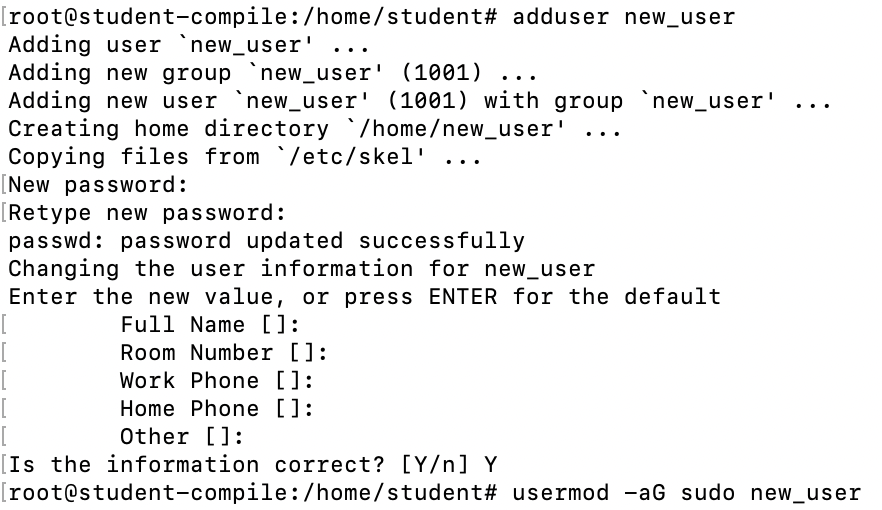

2) Вывод команды 'cat /etc/passwd'. (в конце присутствует новый пользователь(new_user))
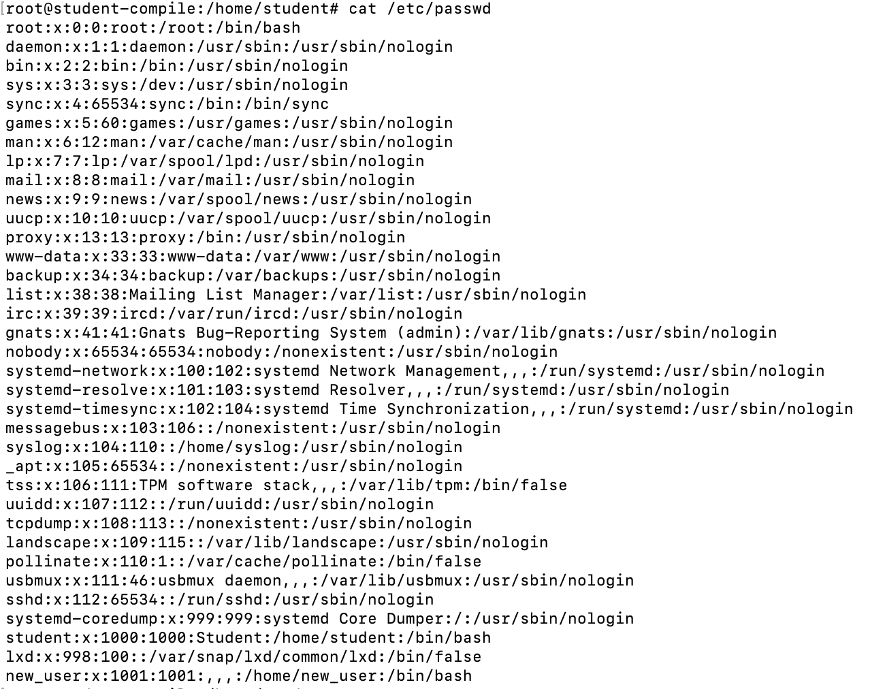

## Part 3. Настройка сети ОС 

1) Создаем нового юзера (user1).
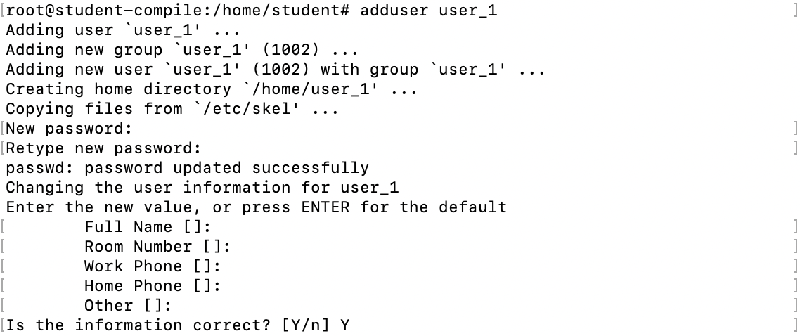

2) Меняем временную зону на Новоосибирск (+7).
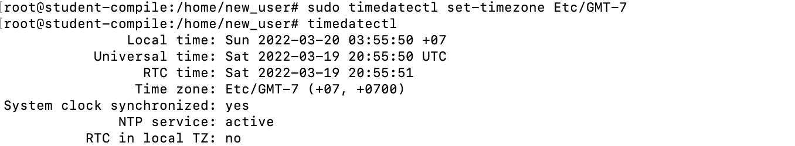

4) Выводим названия сетевых интерфейсов. (показано 2 способа)
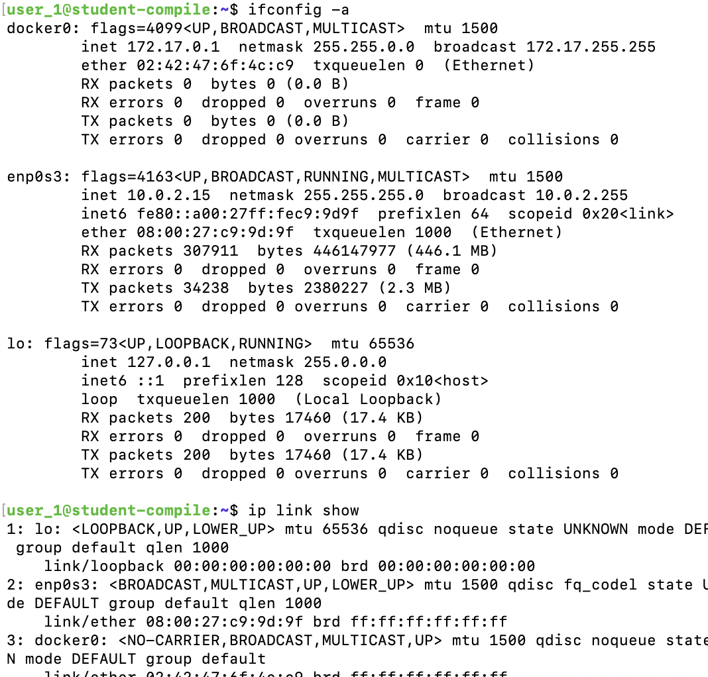

Lo — это loopback device, специальный виртуальный интерфейс, который система использует, чтобы общаться самой с собой. Благодаря lo даже без подключения к сети локальные приложения могут взаимодействовать друг с другом.

5) Определить и вывести на экран внешний ip-адрес шлюза (ip) и внутренний IP-адрес шлюза, он же ip-адрес по умолчанию (gw).
Используя консольную команду получить ip адрес устройства, на котором вы работаете, от DHCP сервера.
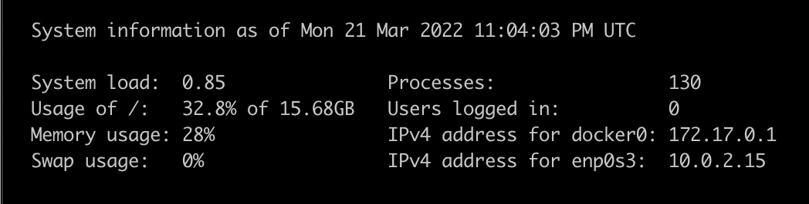

6) Задаю статичные (заданные вручную, а не полученные от DHCP сервера) настройки ip, gw, dns (использовать публичный DNS серверы, например 1.1.1.1 или 8.8.8.8) редактирую yml- файл netplan.
 
Применяем настройки командой sudo netplan apply.

7) Перезагружаем  командой sudo reboot.
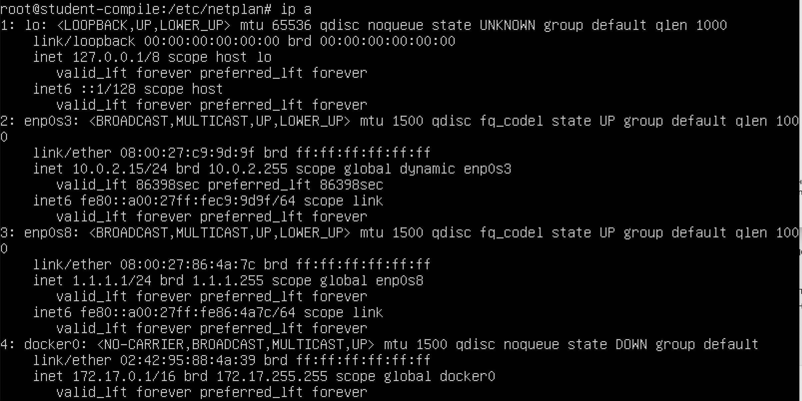 

8) PING 1.1.1.1, 8.8.8.8, ya.ru.
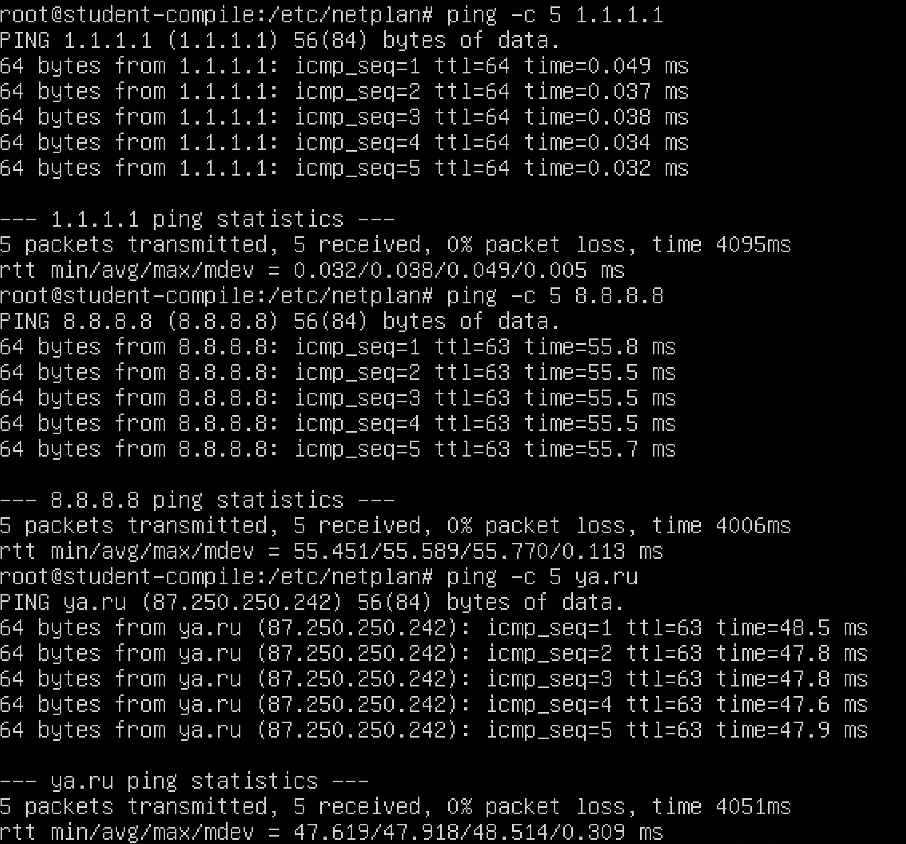 

## Part 4. Обновление ОС 

Обновить системные пакеты до последней на момент выполнения задания версии.
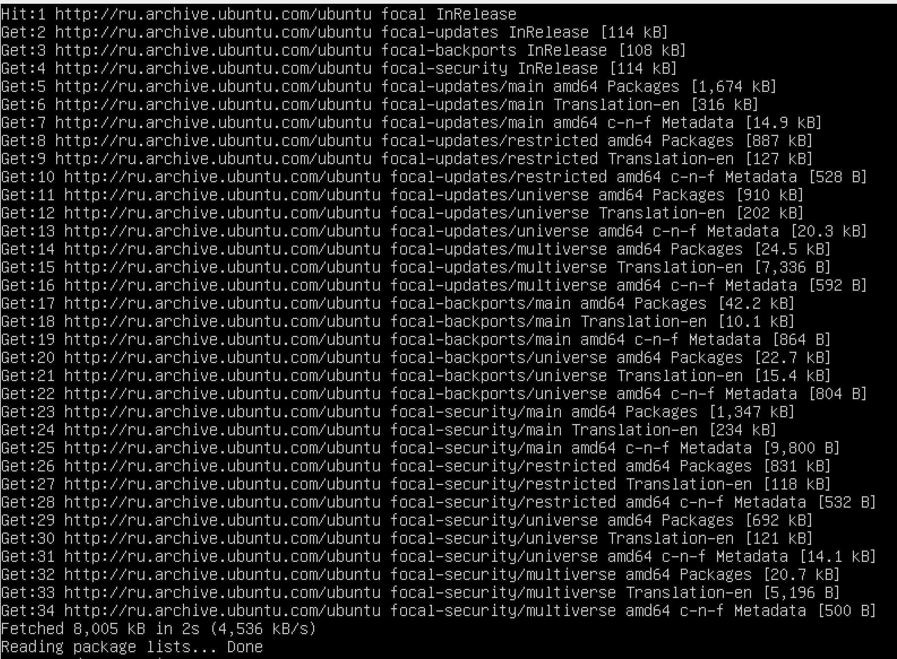
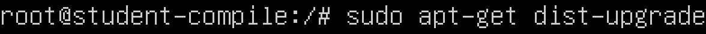

Обновлений больше нет.
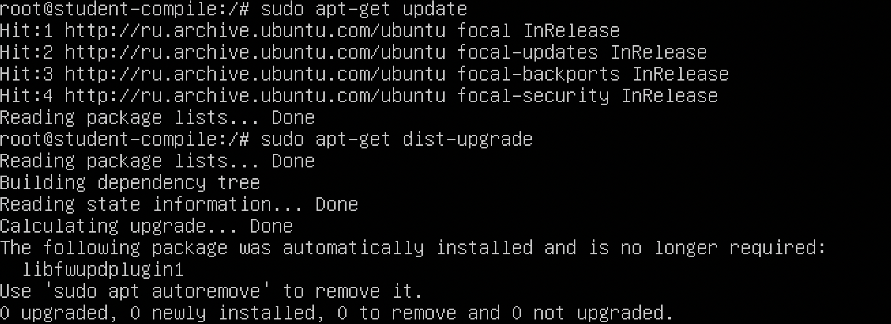

## Part 5. Использование команды sudo 

 1) Даю user1 рут-права.
 
 
 Команда sudo ( substitute user and do, подменить пользователя и выполнить ) позволяет строго определенным пользователям выполнять указанные программы с административными привилегиями без ввода пароля суперпользователя root.
 
 2) Меняю имя хоста.
 

## Part 6. Установка и настройка службы времени 

Настроить службу автоматической синхронизации времени.
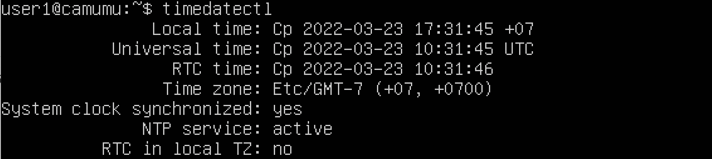

## Part 7. Установка и использование текстовых редакторов 

Я установила  vim, nano, mcedit.

1) Текстовый файл с ником.

 Vim.  i для редактирования и :wq для сохранения изменений.
 
 
 Nano и  mcedit. Печатаю сразу ctrl+X и выбираю сохранить изменения.
 
 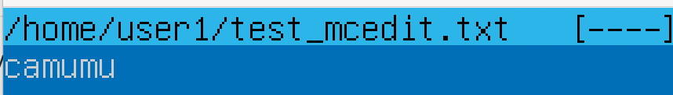
 
 2) Заменить в файле ник на 21 school 21 и выйти без сохранения7
 
 Vim.  i для редактирования и :q! для отмены изменений.
 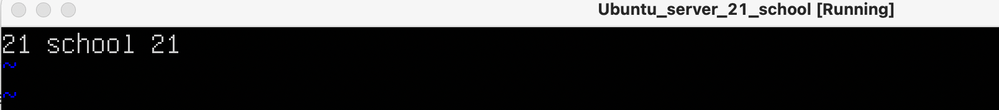
 
 Nano и  mcedit. Печатаю сразу ctrl+X и выбираю не сохранять изменения.
 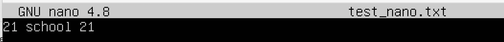
 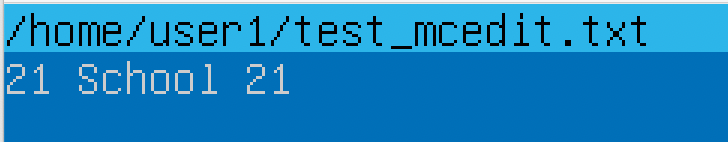
 
 3) Выполнить поис и замену слова.
 
 Vim. %s/что заменяем/на что/g(заменяем все )c(просить подтверждение замены)
 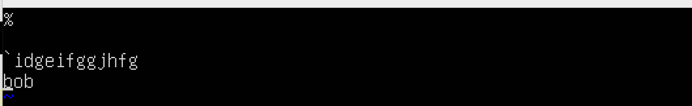
 
 Nano. Нажать ctrl+\  слово для поиска , после на что ее нужно заменить, далее переходя от одного поиска соглашаться или отказываться от замены, чтобы прервать нужно нажать контрол+С
 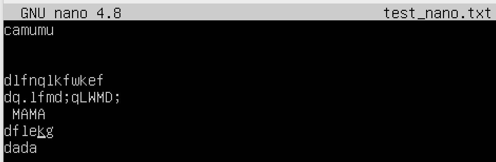
 
 Mcedit. Нажать ? или /слово для поиска, меняем словоб переходя на следующее найденое n.
 

## Part 8. Установка и базовая настройка сервиса SSHD 

1) Установить службу SSHd.
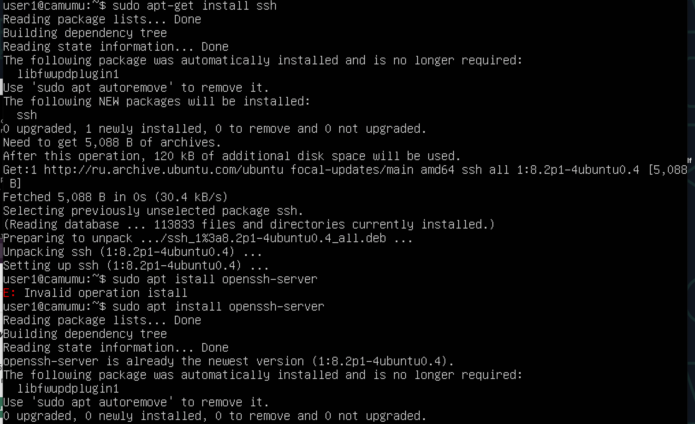

2) Добавить автостарт службы при загрузке системы.

3) Перенастроить службу SSHd на порт 2022.
Используя команду ps, показать наличие процесса sshd. Для этого к команде нужно подобрать ключи.
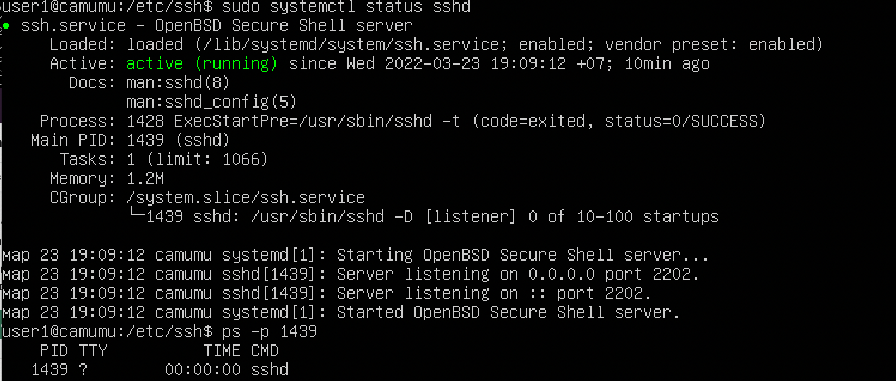

4) Перезагрузить систему командой  sudo reboot.

5) Вывод команды netstat -tan(показывает все соединения, номера хостор и ip-адреса хостов. Поле rescv - принимаемые пакеты, send - отправляемыу, локальны ip, 0.0.0.0 - пказывает, что они пренадлежат к одному адресу, после : - номер хоста, состояние - есть ли соединение с хостом. 
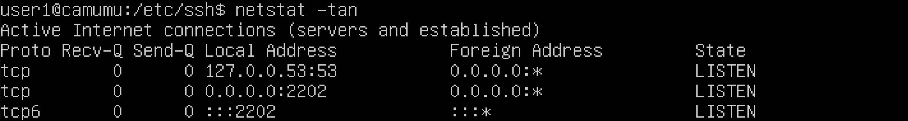

## Part 9. Установка и использование утилит top, htop 

1) Вывод команды  TOP: -uptime 20часов, -1 user, -система загружена на 3%, - 110 процессов, -cup 20%, ~занято памяти 9Gb, -pid 982, -pid 702.

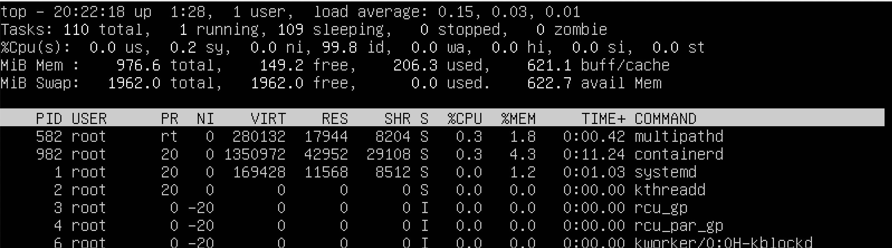
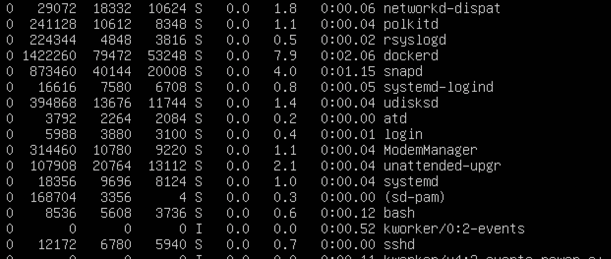

2) Выводы htop.

Oтсортированному по PID, PERCENT_CPU, PERSENT_MEM, TIME.
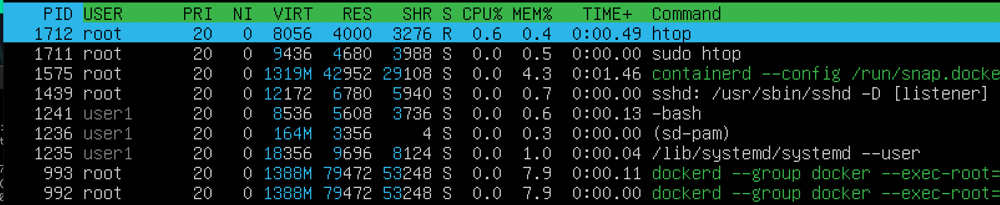
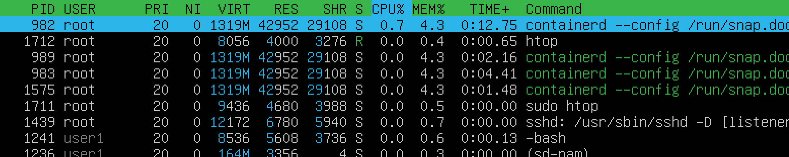
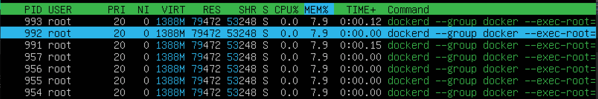
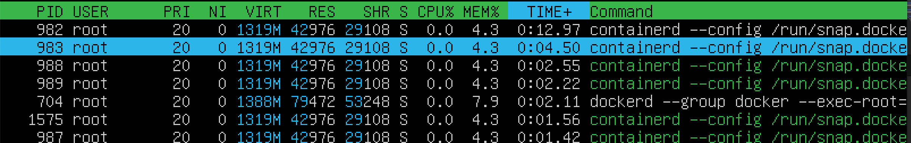

Oтфильтрованному для процесса sshd.
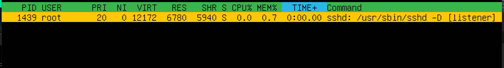

C процессом syslog, найденным, используя поиск.

C добавленным выводом hostname, clock и uptime
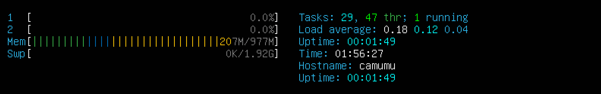

## Part 10. Использование утилиты fdisk 

Название жесткого диска -sda, -размер 16Gb.
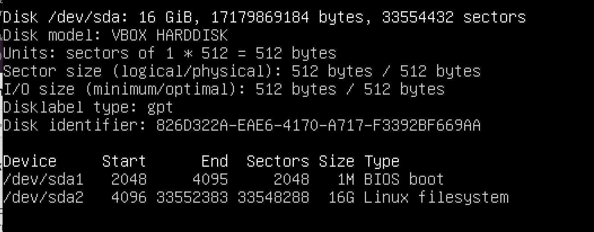
Размер свопа ~2Gb.
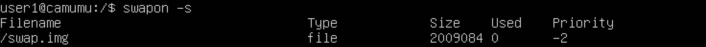

## Part 11. Использование утилиты df 

1) Вывод df.

Для корневого раздела  -размер раздела 16Gb, -занято  ~6Gb, -свободно ~9Gb, - использовано 41%.
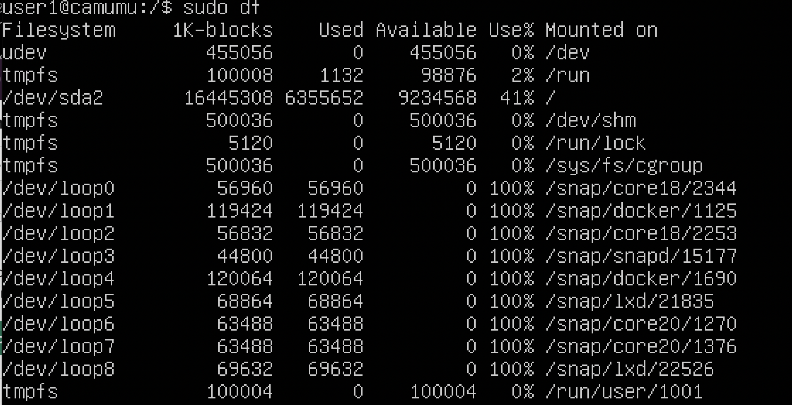
Еденица написания в отчете кибиббайты.

## Part 12. Использование утилиты du 

1) Размер папки /home,  /var,  /var/log
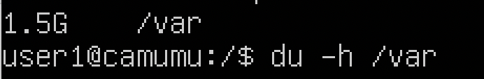
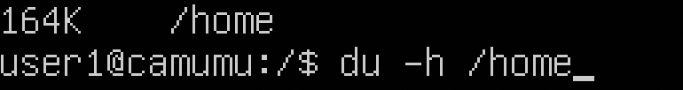
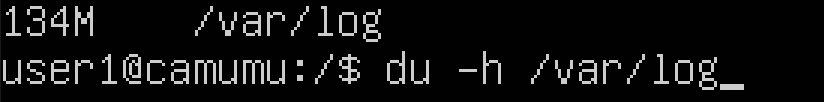

2) Размер всего содержимого /var/log
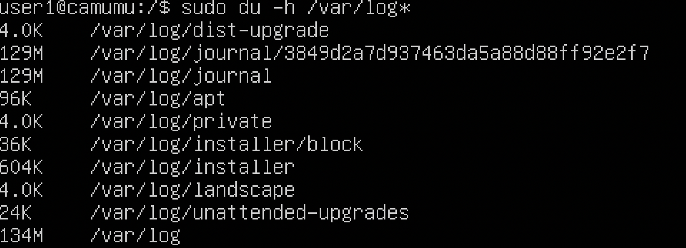

## Part 13. Установка и использование утилиты ncdu 

1) Размер папки /home,  /var,  /var/log
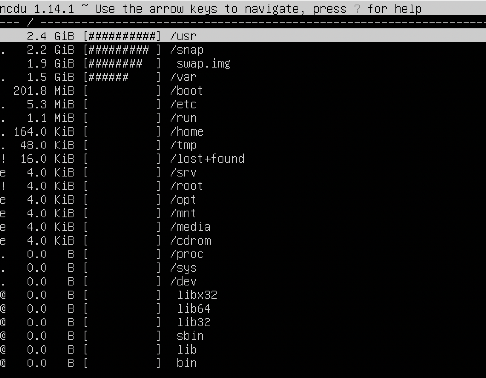
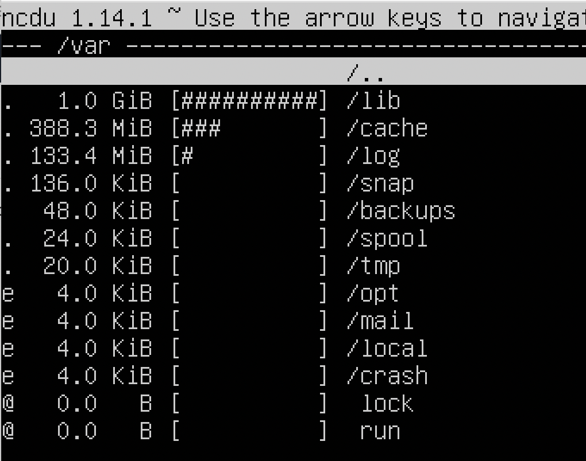

## Part 14. Работа с системными журналами 

1) Oткрываю все файлы с помощью  sudo cat.

2) Последняя авторизация в 23:04, пользователь root, через команндную строку.
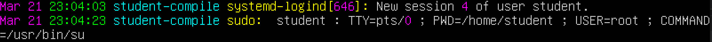

3) Перезапускаю sshd.
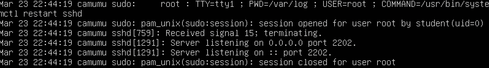

## Part 15. Использование планировщика заданий CRON 

1)  Используя планировщик создаю команду uptime.

 Другие процессы примерно в тоже время.
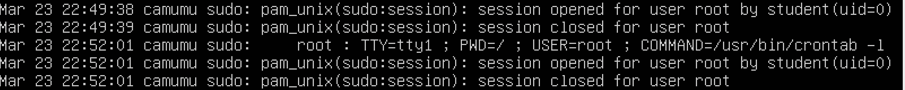

Текущий список задач.
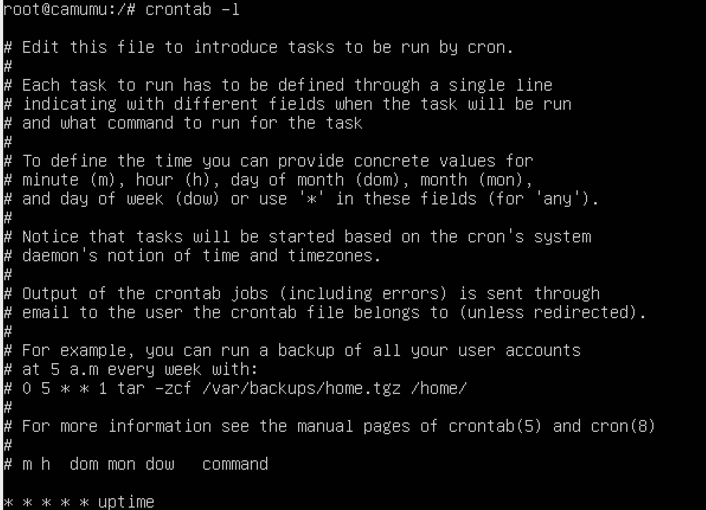

Логи cron в системе.
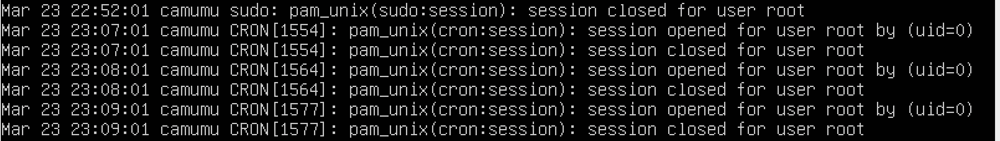

2)  Удаляю все задачи crontab -r. 

Пустой список задач.
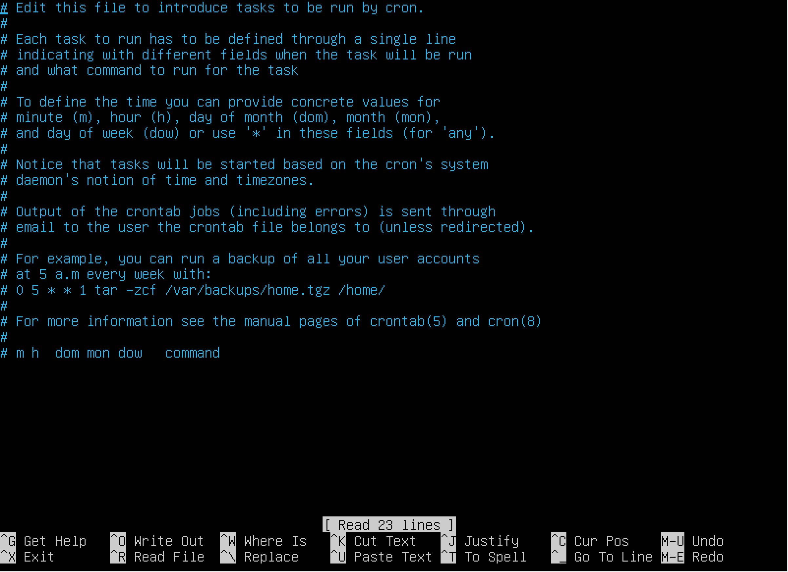
