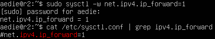
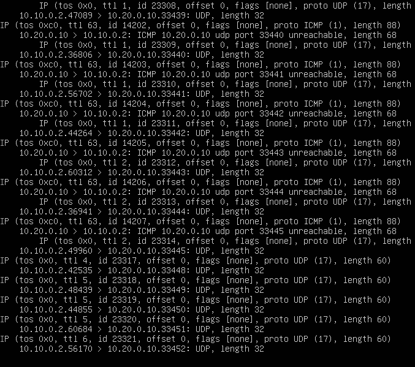

# Сети в Linux

Настройка сетей в Linux на виртуальных машинах.

## Содержание

[Part 1. Инструмент ipcalc](#part-1)

[Part 2. Статическая маршрутизация между двумя машинами](#part-2)

[Part 3. Утилита iperf3](#part-3)

[Part 4. Сетевой экран](#part-4)

[Part 5. Статическая маршрутизация сети](#part-5)

[Part 6. Динамическая настройка IP с помощью DHCP](#part-6)

[Part 7. NAT](#part-7)

[Part 8. Дополнительно. Знакомство с SSH Tunnels](#part-8)

## Part 1. Инструмент ipcalc 

### 1.1 Сети и маски

1) Адрес сети 192.167.38.54/13

- 192.167.38.54/13 (11000000.10100111.00100110.00110110)
- /13 = 255.248.0.0 (11111111.11111000.00000000.00000000)
- Сеть: 192.160.0.0 (11000000.10100000.00000000.00000000)
- IP min: 192.160.0.1 (11000000.10100000.00000000.00000001)
- IP max: 192.167.255.254 (11000000.10100111.11111111.11111110)

2) Перевод маски:

2.1  Маска 255.255.255.0 в префиксную и двоичную запись:
- 255.255.255.0 (normal)
- binary: 11111111.11111111.11111111.00000000
- prefix: /24

2.2 Маска /15 в обычную и двоичную:
- normal: 255.254.0.0
- binary: 11111111.11111110.00000000.00000000

2.3 11111111.11111111.11111111.11110000 в обычную и префиксную:
- normal: 255.255.255.240
- prefix: /28

3)  Минимальный и максимальный хост в сети 12.167.38.4 при масках:

3.1 /8:

- IP min: 12.0.0.1 (00001100.00000000.00000000.00000001)
- IP max: 12.255.255.254 (00001100.11111111.11111111.11111110

3.2 11111111.11111111.00000000.00000000:

- IP min: 12.167.0.1 (00001100.10100111.00000000.00000001)
- IP max: 12.167.255.254 (00001100.10100111.11111111.11111110)

3.3 255.255.254.0:

- IP min: 12.167.38.1 (00001100.10100111.00100011.00000001)
- IP max: 12.167.39.254 (00001100.10100111.00100011.11111110)

3.4 /4:

- IP min: 0.0.0.1 (00000000.00000000.00000000.00000001)
- IP max: 15.255.255.254 (00001111.11111111.11111111.11111110)

### 1.2. localhost

194.34.23.100/16
- localhost: NO

127.0.0.2/24
- localhost: YES

127.1.0.1/8
- localhost: YES

128.0.0.1/8
- localhost: NO

### 1.3. Диапазоны и сегменты сетей

1) Список Private:

> 10.0.0.45/8\
> 192.168.4.2/16\
> 172.20.250.4/12\
> 172.16.255.255/12\
> 10.10.10.10/8

2) Список Public:

> 134.43.0.2/16\
> 172.0.2.1/12\
> 192.172.0.1/12\
> 172.68.0.2/12\
> 192.169.168.1/16

3) Список  шлюзов:

> 10.10.0.2\
> 10.10.10.10\
> 10.10.1.255

## Part 2. Статическая маршрутизация между двумя машинами 

1) Список существующих сетевых интерфейсов в исходной конфигурации на ws1 и ws2 с помощью команды ip a

2) Конфигурация ws1 и ws2 по следующим параметрам:
- ws1 - 192.168.100.10, маска /16
- ws2 - 172.24.116.8, маска /12

по итогу настройки сети на обеих машинах выполнить команду, для перезапуска сервиса сети:

> sudo netplan apply

### 2.1. Добавление статического маршрута вручную

Конфигурация статических маршрутов, в ручную, от одной машины до другой и обратно при помощи команды 
> sudo ip r add 172.24.116.8 via 192.168.100.10\
> sudo ip r add 192.168.100.10 via 172.24.116.8

Проверим/пропингуем соединение между ws1 и ws2

### 2.2. Добавление статического маршрута с сохранением

Конфигурация статических маршрутов, от одной машины до другой и обратно при помощи файла 
> etc/netplan/00-installer-config.yaml.

Проверим/пропингуем соединение между ws1 и ws2

## Part 3. Утилита iperf3 

### 3.1. Скорость соединения

Перевести и записать в отчёт: 8 Mbps в MB/s, 100 MB/s в Kbps, 1 Gbps в Mbps

> 8 Mbps to MB/s = 8 Mbps = 1 MB/s\
> 100 MB/s to Kbps = 781250 / 819200\
> 1 Gbps to Mbps = 1000 / 1024

### 3.2. Утилита iperf3

Измерить скорость соединения между ws1 и ws2

## Part 4. Сетевой экран 

### 4.1. Утилита iptables

Создать и заполнить файл /etc/firewall.sh на ws1 и ws2.\
> Запустить файлы на обеих машинах командами chmod +x /etc/firewall.sh и /etc/firewall.sh

> Правила выполняться сверху-вниз, следовательно, если правило запрета находиться выше оно срабатывает, а правило разрешения находящиеся ниже нет.

### 4.2. Утилита nmap

Командой ping проверим ws1, которая не "пингуется", после чего утилитой nmap проверим, что хост машины запущен

## Part 5. Статическая маршрутизация сети 

### 5.1. Настройка адресов машин

Поднять пять виртуальных машин (3 рабочие станции (ws11, ws21, ws22) и 2 роутера (r1, r2))\
Настроить конфигурации каждой машины в файле etc/netplan/00-installer-config.yaml 

Командой **ip -4 a** проверить, что адрес машины заданы верно. Также пропинговать ws22 с ws21. Аналогично пропинговать r1 с ws11.

Проверка пинга ws22 с ws21.

Проверка пинга r1 с ws11.

### 5.2. Включение переадресации IP-адресов

Для включения переадресации IP, выполните команду на роутерах:

В файлах /etc/sysctl.conf добавьте в него следующую строку:

### 5.3. Установка маршрута по-умолчанию

Настройка маршрутов по-умолчанию (шлюз) для рабочих станций. Для этого добавить gateway4 [ip роутера] в файле конфигураций **etc/netplan/00-installer-config.yaml.**

Вывод команды **ip r** для каждой машины

Пинг с ws11 роутер r2.
На r2  пинг доходит. Для этого использовать команду: 
> tcpdump -tn -i enp0s3

### 5.4. Добавление статических маршрутов

Изменить в r1 и r2 статические маршруты в файле конфигураций. 

Команда **ip r** с выводом таблицы с маршрутами на обоих роутерах.

Запустить команды на **ws11**  **ip r list 10.10.0.0/18** и **ip r list 0.0.0.0/0**

- Для 10.10.0.0/18 был выбран отдельный маршрут, из-за того, что была указана маска сети, при /0 маршрут идет через default
- Шлюз по умолчанию — в маршрутизируемых протоколах — сетевой шлюз, на который пакет отправляется в том случае, если маршрут к сети назначения пакета не известен (не задан явным образом в таблице маршрутизации хоста). Применяется в сетях с хорошо выраженными центральными маршрутизаторами, в малых сетях, в клиентских сегментах сетей. Шлюз по умолчанию задаётся записью в таблице маршрутизации вида «сеть 0.0.0.0 с маской сети 0.0.0.0».

### 5.5. Построение списка маршрутизаторов

При помощи утилиты traceroute построить список маршрутизаторов на пути от ws11 до ws21

Для определения промежуточных routers traceroute отправляет серию ICMP-пакетов (по умолчанию 3 пакета), с каждым шагом увеличивая значение поля TTL на 1. Это поле обычно указывает максимальное количество routers, которое может быть пройдено пакетом. 

Первая серия пакетов отправляется с TTL, равным 1
Traceroute фиксирует адрес routers, а также время между отправкой пакета и получением ответа. Затем traceroute повторяет отправку серии пакетов, но уже с TTL, равным 2

Процесс повторяется до тех пор, пока пакет не достигнет целевого узла. При получении ответа от этого узла процесс трассировки считается завершённым.

На оконечном хосте IP-датаграмма с TTL = 1 не отбрасывается и не вызывает ICMP-сообщения типа срок истёк, а должна быть отдана приложению.

### 5.6. Использование протокола ICMP при маршрутизации

Запуск на r1 перехват сетевого трафика, проходящего через enp0s3 с помощью команды **tcpdump -tnv -i enp0s8 icmp**

Пропинговать с ws11 несуществующий IP (например, 10.30.0.111) с помощью команды:

## Part 6. Динамическая настройка IP с помощью DHCP 

Указать MAC адрес у ws11, для этого в etc/netplan/00-installer-config.yaml надо добавить строки: macaddress: 10:10:10:10:10:BA, dhcp4: true

Для r2 настроить в файле /etc/dhcp/dhcpd.conf конфигурацию службы DHCP:

- указать адрес маршрутизатора по-умолчанию, DNS-сервер и адрес внутренней сети.

- в файле resolv.conf прописать nameserver 8.8.8.8.

- Перезагрузить службу DHCP командой **systemctl restart isc-dhcp-server**

- На машине ws21 через ip a просмотреть конфигурация. Также пропинговать ws22 с ws21.

Для r1 настроить аналогично, но сделать выдачу адресов с жесткой привязкой к MAC-адресу (ws11). 

- настройка dhcp.conf

-  настройка resolv.conf

- перезагрузка и проверка статус работы dhcp.server

- проверка конфигруации и пинг ws22

Запросить с ws21 обновление ip адреса

В начале клиент выполняет широковещательный запрос по всей физической сети с целью обнаружить доступные DHCP-серверы. Он отправляет сообщение типа DHCPDISCOVER, при этом в качестве IP-адреса источника указывается 0.0.0.0, а в качестве адреса назначения —широковещательный адрес 255.255.255.255.

Получив сообщение от клиента, сервер определяет требуемую конфигурацию клиента в соответствии с указанными сетевым администратором настройками. В данном случае DHCP-сервер согласен с запрошенным клиентом адресом 10.20.0.23. Сервер отправляет ему ответ (DHCPOFFER), в котором предлагает конфигурацию.

Выбрав одну из конфигураций, предложенных DHCP-серверами, клиент отправляет запрос DHCP (DHCPREQUEST). Он рассылается широковещательно; при этом к опциям, указанным клиентом в сообщении DHCPDISCOVER.

Наконец, сервер подтверждает запрос и направляет это подтверждение (DHCPACK) клиенту. После этого клиент должен настроить свой сетевой интерфейс, используя предоставленные опции

## Part 7. NAT 
В файле /etc/apache2/ports.conf на ws22 и r2 изменить строку Listen 80 на Listen 0.0.0.0:80, то есть сделать сервер Apache2 общедоступным

Запустить веб-сервер Apache командой service apache2 start на ws22 и r1

Добавить /etc/firewall.sh, на r2 следующие правила:

Проверка соединение между ws22 и r1 командой ping
При запуске файла с этими правилами, ws22 не должна "пинговаться" с r1

Добавить /etc/firewall.sh на r2 ещё одно правило:
- Разрешить маршрутизацию всех пакетов протокола ICMP

Проверить соединение между ws22 и r1 командой ping
При запуске файла с этими правилами, ws22 должна "пинговаться" с r1

Добавить /etc/firewall.sh на r2 ещё одно правило:
- Включить SNAT, а именно маскирование всех локальных ip из локальной сети, находящейся за r2 (по обозначениям из Части 5 - сеть 10.20.0.0)
Совет: стоит подумать о маршрутизации внутренних пакетов, а также внешних пакетов с установленным соединением
- Включить DNAT на 8080 порт машины r2 и добавить к веб-серверу Apache, запущенному на ws22, доступ извне сети

Проверить соединение по TCP для SNAT, для этого с ws22 подключиться к серверу Apache на r1 командой:

Проверить соединение по TCP для DNAT, для этого с r1 подключиться к серверу Apache на ws22 командой telnet

## Part 8. Дополнительно. Знакомство с SSH Tunnels 

Необходимо включить поддержку перенаправления
> /etc/ssh/sshd_config:\
> AllowTcpForwarding yes

Используем Local TCP forwarding с ws21 до ws22, чтобы получить доступ к веб-серверу на ws22 с ws21
Для проверки подключение выполнить команду:
> telnet localhost 8080

Используем Remote TCP forwarding c ws11 до ws22, чтобы получить доступ к веб-серверу на ws22 с ws11
Для проверки подключение выполнить команду:
> telnet localhost 8080

